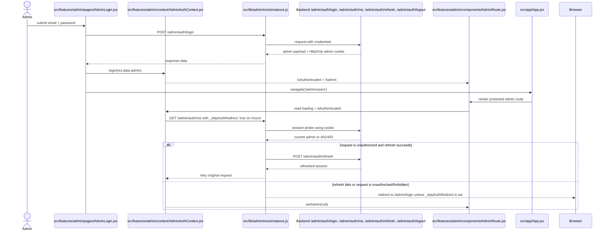

# Admin Auth Flow

## Notes

- The current admin auth is context-based, not Redux-based. `login()` stores the admin object in `AdminAuthContext`.
- `AdminAuthContext` bootstraps session state by calling `GET /admin/auth/me` with `_skipAuthRedirect: true` so initial auth checks do not create login redirect loops.
- `AdminRoute` gates access by `loading` and `isAuthenticated`, not by a separate admin Redux slice.
- `adminAxiosInstance` does include refresh retry handling for admin requests via `POST /admin/auth/refresh` before redirecting to `/admin/login`.
- `logout()` clears the context state and also calls `POST /admin/auth/logout`.
