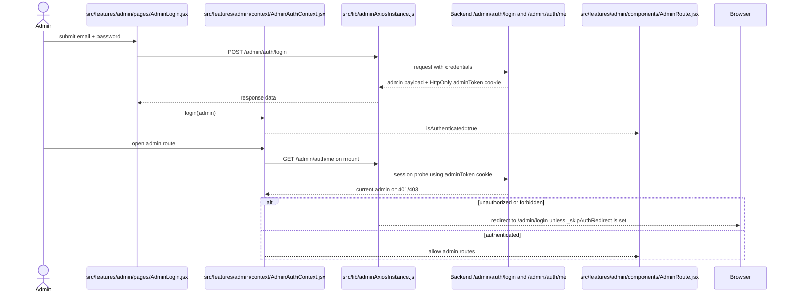

# Admin Auth Flow

```mermaid
sequenceDiagram
  actor Admin
  participant Login as src/features/admin/pages/AdminLogin.jsx
  participant Context as src/features/admin/context/AdminAuthContext.jsx
  participant AdminAxios as src/lib/adminAxiosInstance.js
  participant API as Backend /admin/auth/login and /admin/auth/me
  participant Guard as src/features/admin/components/AdminRoute.jsx

  Admin->>Login: submit email + password
  Login->>AdminAxios: POST /admin/auth/login
  AdminAxios->>API: request with credentials
  API-->>AdminAxios: admin payload + HttpOnly adminToken cookie
  AdminAxios-->>Login: response data
  Login->>Context: login(admin)
  Context-->>Guard: isAuthenticated=true
  Admin->>Context: open admin route
  Context->>AdminAxios: GET /admin/auth/me on mount
  AdminAxios->>API: session probe using adminToken cookie
  API-->>Context: current admin or 401/403
  alt unauthorized or forbidden
    AdminAxios-->>Browser: redirect to /admin/login unless _skipAuthRedirect is set
  else authenticated
    Context-->>Guard: allow admin routes
  end
```

## Notes

- There is no refresh-token retry flow for admin requests.
- `AdminAuthContext` boots from `/admin/auth/me` and `AdminRoute` gates access based on that state.
