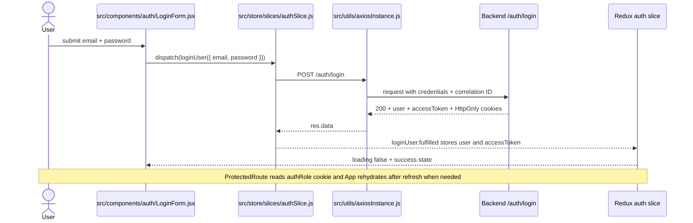

# Auth Login Flow

## Notes

- The login thunk lives in `src/store/slices/authSlice.js`.
- The authenticated axios client lives in `src/utils/axiosInstance.js`.
- The backend sets the refresh cookie; the frontend stores the access token in Redux.
