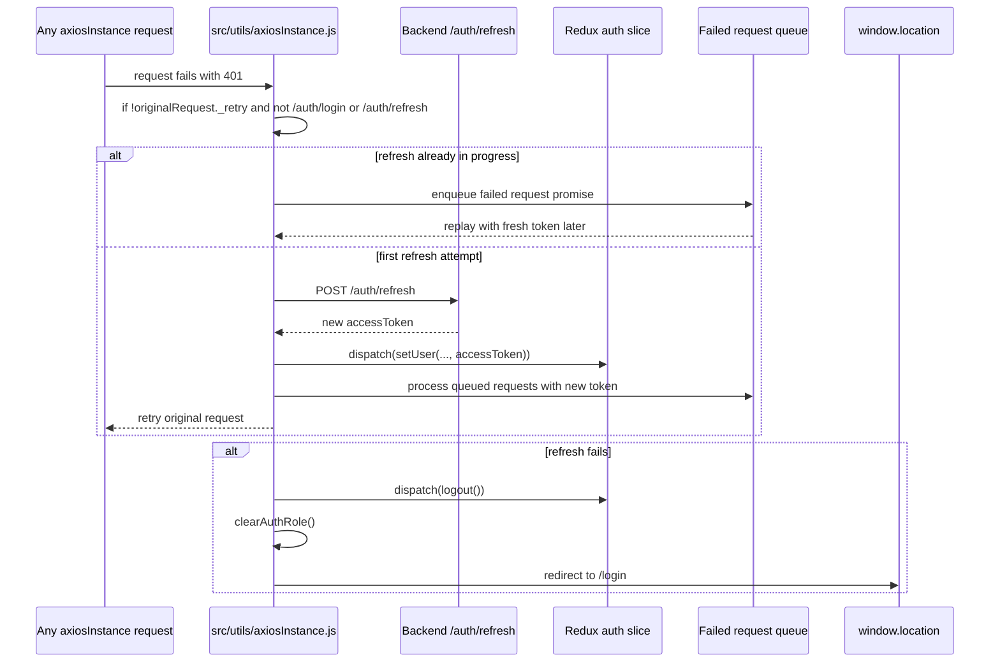

# Auth Refresh Flow

```mermaid
sequenceDiagram
  participant Caller as Any axiosInstance request
  participant Axios as src/utils/axiosInstance.js
  participant API as Backend /auth/refresh
  participant Store as Redux auth slice
  participant Queue as Failed request queue
  participant Browser as window.location

  Caller->>Axios: request fails with 401
  Axios->>Axios: if !originalRequest._retry and not /auth/login or /auth/refresh
  alt refresh already in progress
    Axios->>Queue: enqueue failed request promise
    Queue-->>Axios: replay with fresh token later
  else first refresh attempt
    Axios->>API: POST /auth/refresh
    API-->>Axios: new accessToken
    Axios->>Store: dispatch(setUser(..., accessToken))
    Axios->>Queue: process queued requests with new token
    Axios-->>Caller: retry original request
  end
  alt refresh fails
    Axios->>Store: dispatch(logout())
    Axios->>Axios: clearAuthRole()
    Axios->>Browser: redirect to /login
  end
```

## Notes

- The queueing logic is in `src/utils/axiosInstance.js`.
- The refresh path is used only for the main authenticated client, not for admin requests.
