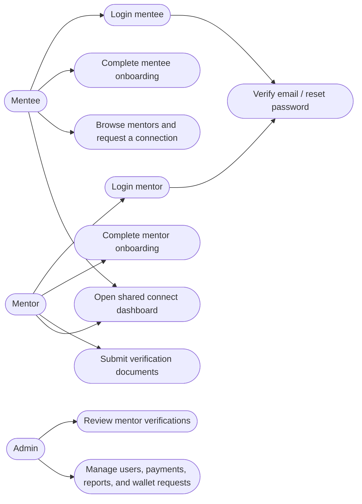

# Use Cases

The flows below are derived from the route definitions in `src/App.jsx` and the route guards in `ProtectedRoute.jsx` and `AdminRoute.jsx`.

## Route-Gated Actions

- Mentor-only routes: `/onboarding/mentor`, `/verify-documents`, `/dashboard/mentor`, and `/dashboard/mentor/edit-profile`.
- Mentee-only routes: `/onboarding/mentee`, `/dashboard/mentee`, and `/dashboard/mentee/edit-profile`.
- Admin routes: `/admin/*` except `/admin/login`.
- Shared connect route: `/shared-dashboard/:connectRequestId`.

## What Not To Infer

- This diagram does not add personas, permissions, or business steps that are not visible in the route tree.
- It does not claim any approvals, compliance steps, or team processes beyond what the code actually routes to.
